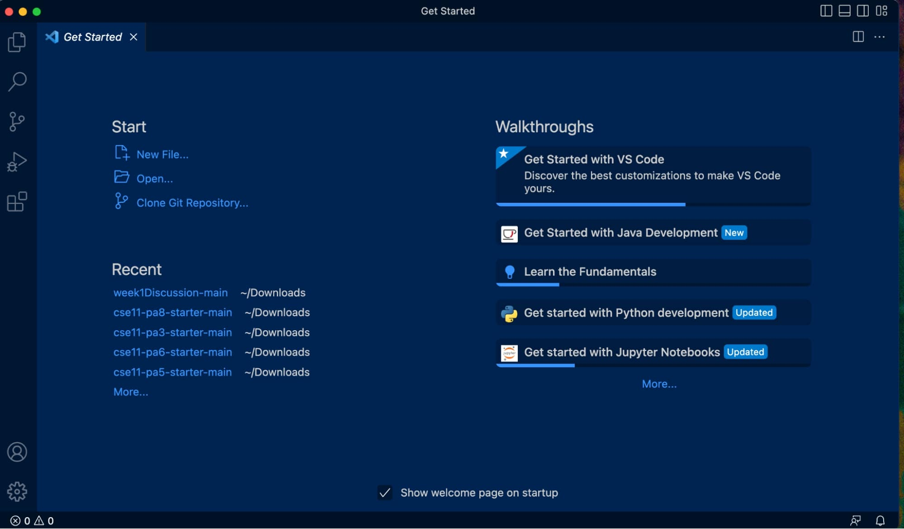
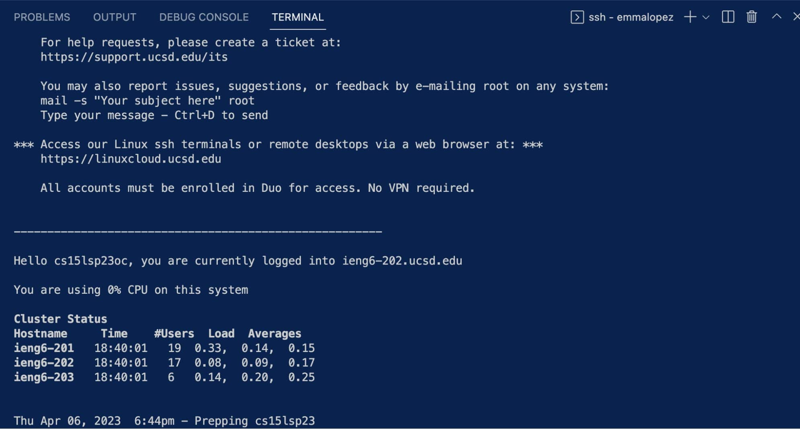
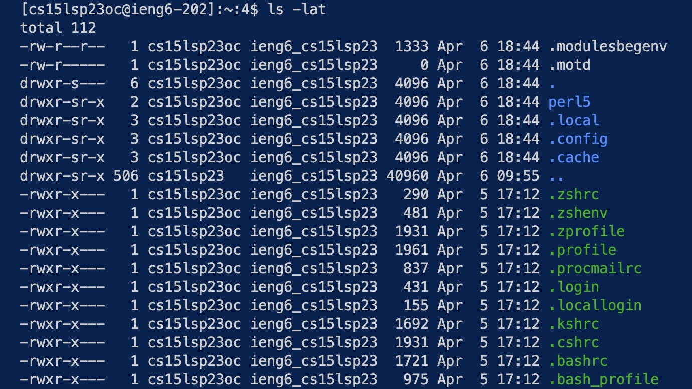
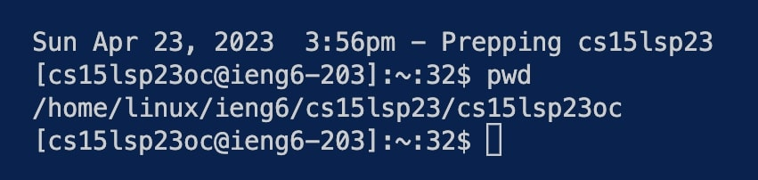

# Lab Report 1
Hello, fellow CS 15L student! Welcome to lab report number one. When attempting to remotely access a server via a course-specific account, 
you should take the following steps to ensure success!

---

## 1. Installing VScode

The first step to take is installing VScode, the programming software where you will be able to remotely access the server. 
Visit the [Visual Studio Code Website](https://code.visualstudio.com) and follow the instructions there to download and install it on your own
computer. Be sure to select the right one for your operating system, such as macOS or Windows.

If installed correctly, you should be able to open a window that looks something like this, though it may have a slightly different color theme.

## 2. Remotely Connecting

The second step is to remotely connect to the server using your course-specific account on ``ieng6``. 
To use ``ssh``, open a terminal in VScode via View → Terminal on macOS.

Type in the command as such, but with ``xx`` replaced with the letters in your course-specific account. Don't forget that ``$`` is directing the spot where
the command is to be typed, and is not meant to be inputed with the rest of the command.

``$ ssh cs15lsp23xx@ieng6.ucsd.edu``

If you are unsure as to what the letters of your course-specific account are, use the [UCSD lookup system](https://sdacs.ucsd.edu/~icc/index.php)
to help you out.

As this will most likely be the first time you are connecting to the server, you will be prompted with a question as to whether or not you want to 
continue connecting. Type ``yes`` into the terminal and press return.

Now, the server will prompt you for your password as a security measure. You must reset your password with the pasword change tool on the 
[UCSD lookup system](https://sdacs.ucsd.edu/~icc/index.php). Don't forget that you are reseting your password for this class only, not the 
Active Directory System! Note that your password will not be displayed in the terminal, so it is best to copy and paste it from a secure document before 
pressing return.

Once you are greeted with a terminal that looks something like this, you will be able to remotely access the server!

## 3. Trying Some Commands

This third step is all about trying out commands both on your computer and the remote computer server. Note that some may return different output
depending on whether or not you are logged into the server.

For example, you might consider these:

``pwd``: print working directory, which indicates the path a program may use to determine the location of a specific file.

``cd ~``: change the directory where you are currently working.

``ls -lat``: lists all files and folders in the given path, which is `-lat` in this instance.

``cat /home/linux/ieng6/cs15lsp23/public/hello.txt``: concatentate two files together. Because there is only one file mentioned in this command, the terminal will simply print the contents of the file ``hello.txt``.

The first command I tried was ``ls -lat``, which returned the following:

A second command I tried was ``pwd``, the result of which is returned below.

Once completed, you may log out of the server by using ``Ctrl`` and ``D``.

**Congratulations, you have now learned how to access the remote server using ``ieng6``!**
