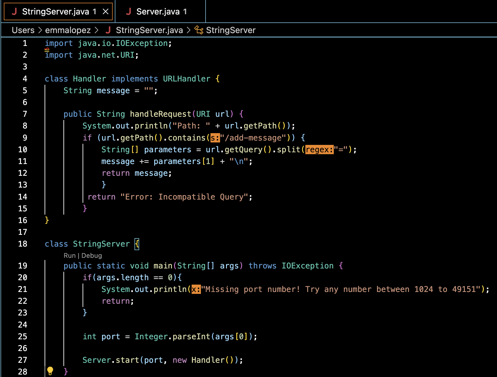
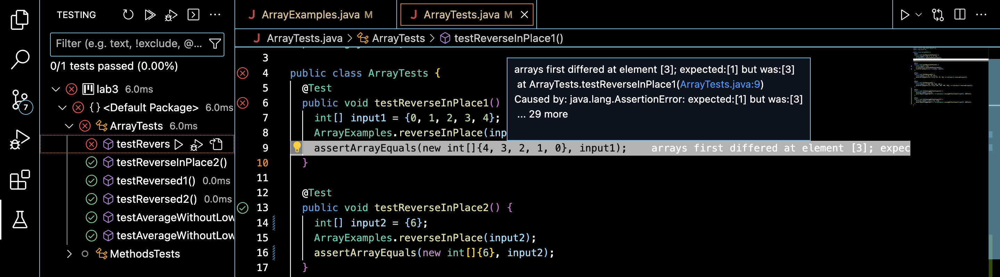

# Lab Report 2
Hello, fellow CS 15L student! Welcome to lab report number two.

---

## Part 1

Below is my code of ``StringServer``, which creates a basic search engine for string queries.



Below is my entry upon adding entering the request ``add-message?s=Hello`` :


- My code calls the methods ``getPath()`` and ``getQuery()`` to take in the given path, query, 
respectively.
- The relevant argument to ``getPath()`` is ``/add-message``. Two of its specific values
are ``http://localhost:4004``, which is the URI, and ``4004``, which is the port number. ``/add-message`` is its 
path, which is assessed as a ``String`` and compared in the if-statement in ``StringServer``.
- The relevant argument to ``getQuery()`` is ``?s=Hello``. Its specific value is ``Hello``, which is a ``String``
used to determine whether or not the body of the if-statement should be executed.
- One field changed after this request is processed is ``message``, which is appended to include ``Hello``:
the first query. Another field that is changed is the ``String[] array`` ``parameters``, which is a two element
array containing the result of splitting the URI at its equal sign.

Below is my entry upon adding entering the request ``add-message?s=How Are You`` :


- My code calls the methods ``getPath()`` and ``getQuery()`` to take in the given path, query, 
respectively.
- The relevant argument to ``getPath()`` is ``/add-message``. Two of its specific values
are ``http://localhost:4004``, which is the URI, and ``4004``, which is the port number. ``/add-message`` is its 
path, which is assessed as a ``String`` and compared in the if-statement in ``StringServer``.
- The relevant argument to ``getQuery()`` is ``?s=How are you``. Its specific value is ``How are you``, which is a ``String``
used to determine whether or not the body of the if-statement should be executed.
- A field changed after this request is processed is ``message``, which is appended to include ``How are you``
in addition to ``Hello``, which it already contains. Another field that is updated is the ``String[] array`` ``parameters``,
which is a two element array containing the result of splitting the URI at its equal sign.


## Part 2

The following bug is a part of the ``reverseInPlace(int[] arr)`` method in ``ArrayExamples.java``, and its corresponding
test was assessed in ``ArrayTests.java``.

**Failure-Inducing Input**

```
public void testReverseInPlace1() {

    int[] input1 = {0, 1, 2, 3, 4};

    ArrayExamples.reverseInPlace(input1);

    assertArrayEquals(new int[]{4, 3, 2, 1, 0}, input1);

  }  
```
This failure-inducing input yields ``{4, 3, 2, 3, 4}``, which differs from the expected output.

**Non Failure-Inducing Input**
```
public void testReverseInPlace2() {

  int[] input2 = {6};
  
  ArrayExamples.reverseInPlace(input2);
  
  ArrayExamples.reverseInPlace(input2);
  
  assertArrayEquals(new int[]{6}, input2);
  
 }
 ```
 
 This non failure-inducing input yields ``{6}``, which is the same as the expected output.

**Symptom**



As shown by the JUNIT tests, the first one with the multi-element array does not work as expected, as it expeced the 
1 to be located at a different index than that of the current ouput. The single-element array's test, on the other
hand, shows that the current output has been produced and the test has been passed.

**Bug**

Below is what was initally located within the body of the method:

```
static void reverseInPlace(int[] arr) {

    for(int i = 0; i < arr.length; i += 1) {
    
      arr[i] = arr[arr.length - i - 1];
      
    }
    
  }
```

Below is what is now initally located within the body of the method:

```
static int[] reverseInPlace(int[] arr) {

    for(int i = 0; i < arr.length / 2; i += 1) {
    
      int temp = arr[i];
      
      arr[i] = arr[arr.length - i - 1];
      
      arr[arr.length - i - 1] = temp;
    }
    
    return arr;
    
  }
```

The code fix addresses the appropriate issue with the program because now the elements that are located at the halfway
point in the array will not be immediately added, completely replaced by that which was already there. Rather, it saves the
element into a ``temp`` variable and then assigns it to the values at the correct 


## Part 3

1) I learned more about writing test cases and debugging code in this lab, specifically when it comes to determining the difference between a symptom and a bug. While a symptom is an inconsistency between test output and input, a bug refers to the specific error in a program.

2) I also learned that, when it comes to writing failure-inducing input, I should note that errors on a small scale will tend to cause the same errors on a large scale, which means that writing test cases need not involve arrays of any particularly large sizes.

**Thank you! You have determined what I have learned about writing server files, as well as debugging code!**