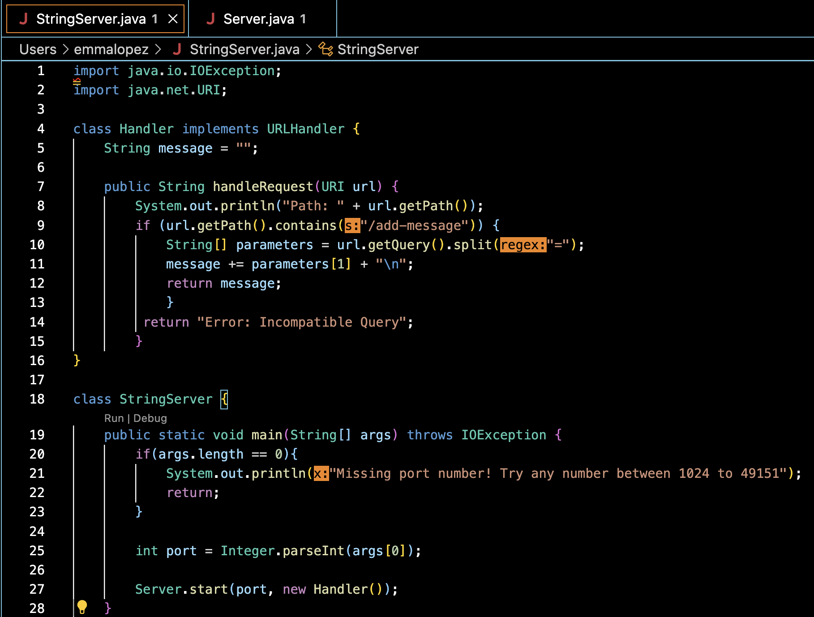
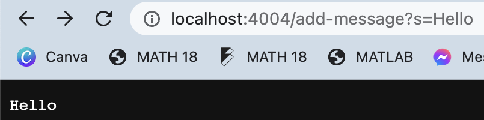
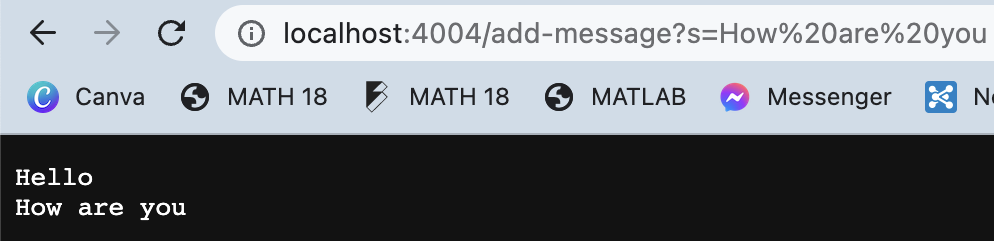

# Lab Report 2
Hello, fellow CS 15L student! Welcome to lab report number two.

---

## Part 1

Below is my code of the StringServer file, which creates a basic search engine for string queries.

Here is my entry of ``add-message?s=Hello``:

Here is my entry of ``add-message?s=How Are You``:

I have called the methods getPath() and getQuery() to take in the file path and query to assess them appropriately before 
concatenating them to the message string.

The relevant arguments to these methods, respectively, are the given URLs and queries from the user. They are String values
that are added to the message string.

The message field changes based on the query that the user enters, as it needs to be updated to reflect previous queries. If
there aren't any, then no change is made.

## Part 2

## Part 3

1) I learned more about writing test cases and debugging code in this lab, specifically when it comes to determining the difference between a symptom and a bug. While a symptom is an inconsistency between test output and input, a bug refers to the specific error in a program.

2) I also learned that, when it comes to writing failure-inducing input, I should note that errors on a small scale will tend to cause the same errors on a large scale, which means that writing test cases need not involve arrays of any particularly large sizes.

**Thank you! You have determined what I have learned about writing server files, as well as debugging code!**
