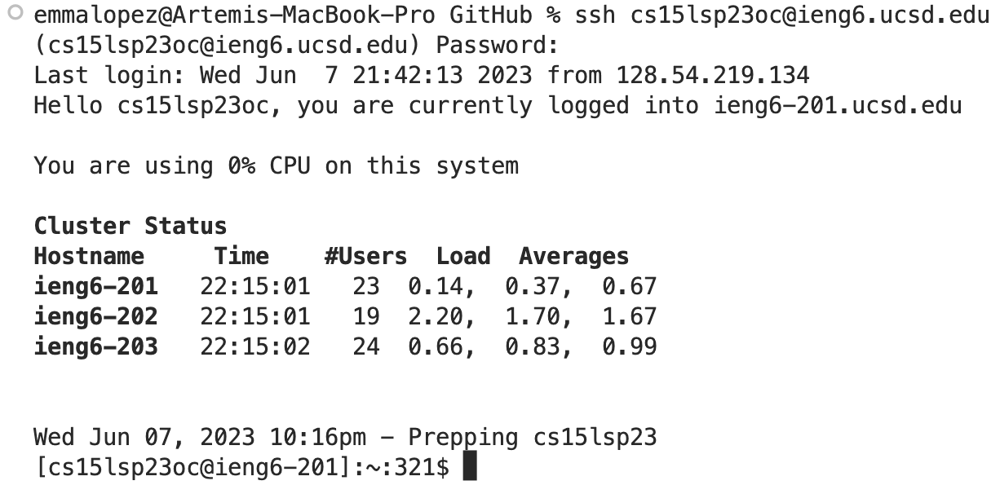
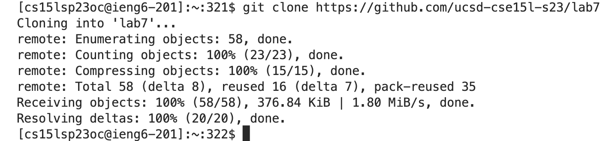
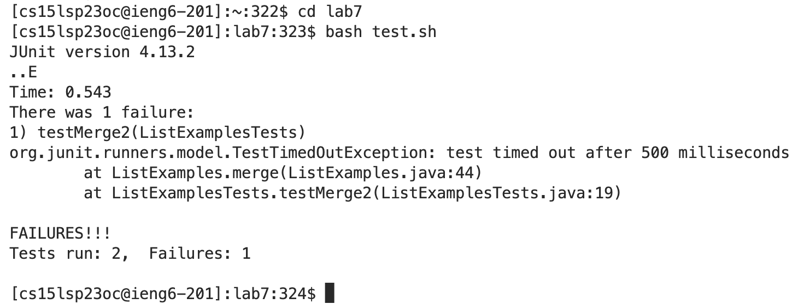
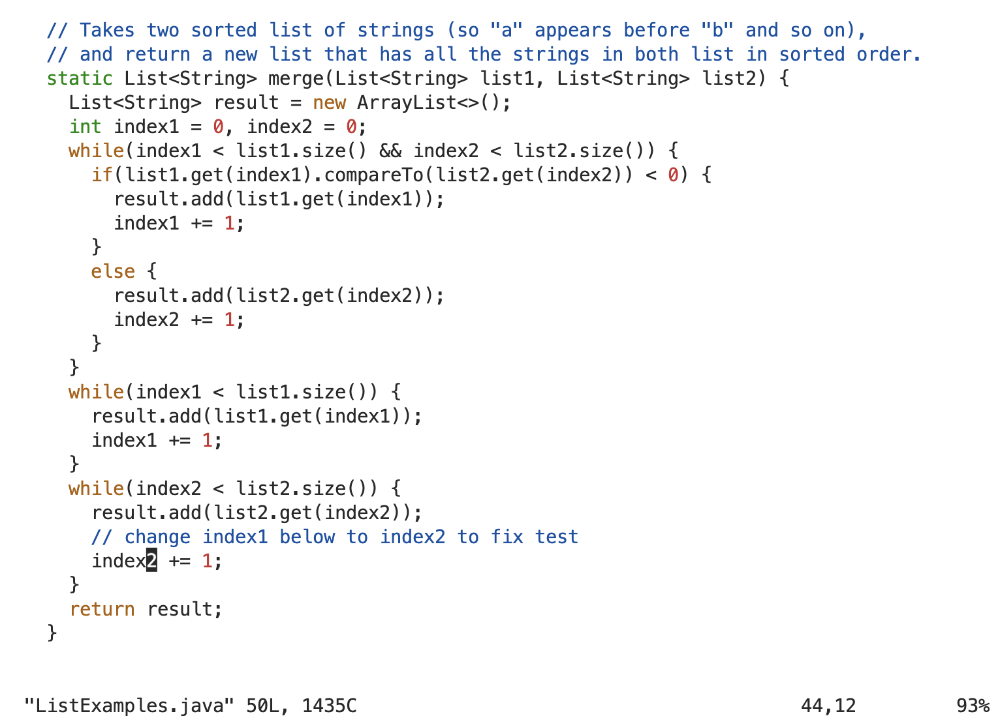
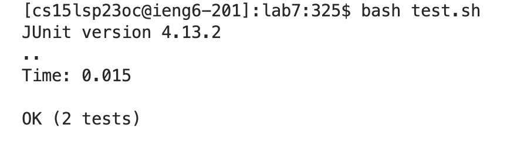
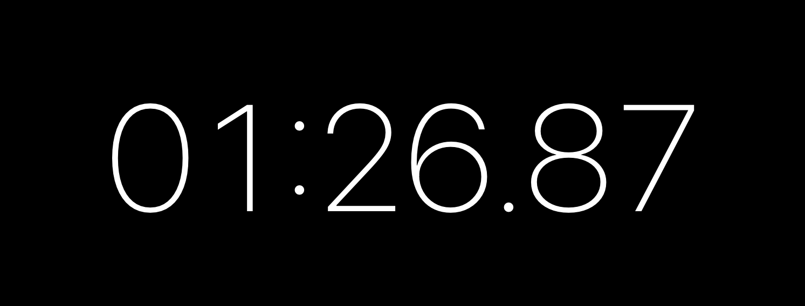
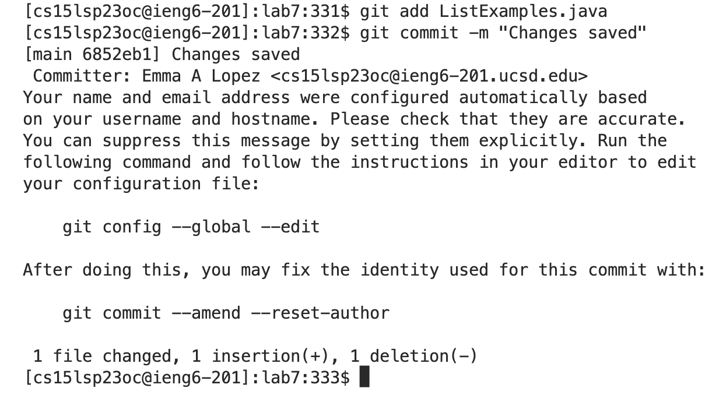

# Lab Report 4
Hello, fellow CS 15L student! Welcome to lab report number one. When attempting to edit files with `vim`, be sure to take care
when determining the correct keystrokes to make.

---

## Step 4
**Log into ieng6.**

*Keys Pressed:* `ssh cs15lsp23oc@ieng6.ucsd.edu <enter>`, `HiHelloHolaBonjour!<enter>` These were my keystrokes when the server prompted me to enter my password.

## Step 5
**Clone your fork of the repository from your Github account.**

*Keys Pressed:* `git clone https://github.com/ucsd-cse15l-s23/lab7 <enter>`

## Step 6
**Run the tests, demonstrating that they fail.**

*Keys Pressed:* `cd lab7 <enter>`, `bash test.sh <enter>`

## Step 7
**Edit the code file to fix the failing test.**

*Keys Pressed:* `vim ListExamples.java <enter>`, `<up><up><up><right><right><right><right><right><right><right><right><right> x`,
`i <enter>`, `2 <enter>`, `<esc>`, `:wq`

## Step 8
**Run the tests, demonstrating that they now succeed.**

*Keys Pressed:* `<up><up> <enter>` The `bash test.sh` command was up two in the search
history, so I used the arrow keys to access it.

## Step 9
**Commit and push the resulting change to your Github account.**

*Keys Pressed:* `git add ListExamples.java`, `git commit -m "Changes saved!"`

