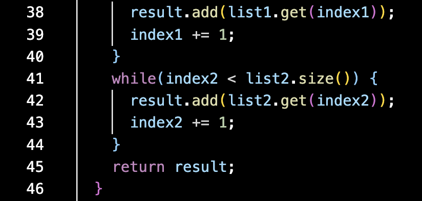

# Lab Report 5
Hello, fellow CS 15L student! Welcome to lab report number five. Today, you will be learning about the debugging process.

---

## 1. Debugging Scenario

*Original Student Post*

**What environment are you using (computer, operating system, web browser, terminal/editor, and so on)?**

I am using a MacBook Pro running MacOS software using Visual Studio Code within a `zsh` terminal.
My file structure includes the `lib` folder with JUnit, my `ListExamples.java` file, and my tester file `TestListExamples.java`.

**Detail the symptom you're seeing. Be specific; include both what you're seeing and what you expected to see instead. 
Screenshots are great, copy-pasted terminal output is also great. Avoid saying “it doesn't work”.**

After compiling and attempting to run my file `ListExamples.java` with the following commands,

```
javac ListExamples.java
java ListExamples
```

I recieved the following terminal output:

```
Error: Could not find or load main class ListExamples
Caused by: java.lang.ClassNotFoundException: ListExamples
```

Rather than these errors, I expected to see two correct test classes passing within the `TestListExamples` file.

In the autograder, I am seeing the following terminal output:

```
ListExamples.java:4: error: duplicate class: StringChecker
interface StringChecker { boolean checkString(String s); }
^
ListExamples.java:6: error: duplicate class: ListExample
class ListExample {
^
TestListExamples.java:17: error: cannot access ListExamples
    List<String> merged = ListExamples.merge(left, right);
                          ^
  bad source file: ./ListExamples.java
    file does not contain class ListExamples
    Please remove or make sure it appears in the correct subdirectory of the sourcepath.
3 errors
JUnit version 4.13.2
.E
Time: 0.001
There was 1 failure:
1) initializationError(org.junit.runner.JUnitCommandLineParseResult)
java.lang.IllegalArgumentException: Could not find class [TestListExamples]
        at org.junit.runner.JUnitCommandLineParseResult.parseParameters(JUnitCommandLineParseResult.java:100)
        at org.junit.runner.JUnitCommandLineParseResult.parseArgs(JUnitCommandLineParseResult.java:50)
        at org.junit.runner.JUnitCommandLineParseResult.parse(JUnitCommandLineParseResult.java:44)
        at org.junit.runner.JUnitCore.runMain(JUnitCore.java:72)
        at org.junit.runner.JUnitCore.main(JUnitCore.java:36)
Caused by: java.lang.ClassNotFoundException: TestListExamples
        at java.base/jdk.internal.loader.BuiltinClassLoader.loadClass(BuiltinClassLoader.java:641)
        at java.base/jdk.internal.loader.ClassLoaders$AppClassLoader.loadClass(ClassLoaders.java:188)
        at java.base/java.lang.ClassLoader.loadClass(ClassLoader.java:521)
        at java.base/java.lang.Class.forName0(Native Method)
        at java.base/java.lang.Class.forName(Class.java:495)
        at java.base/java.lang.Class.forName(Class.java:474)
        at org.junit.internal.Classes.getClass(Classes.java:42)
        at org.junit.internal.Classes.getClass(Classes.java:27)
        at org.junit.runner.JUnitCommandLineParseResult.parseParameters(JUnitCommandLineParseResult.java:98)
        ... 4 more

FAILURES!!!
Tests run: 1,  Failures: 1

Grade: 0/10 - Failed Test Cases
```

Rather than these errors, I expected to see that both of my tests had passed.

**Detail the failure-inducing input and context. That might mean any or all of the command you're running, a test case, 
command-line arguments, working directory, even the last few commands you ran. Do your best to provide as much context 
as you can.**

The following are screenshots of my file `ListExamples.java`, which I was attempting to compile and run:




The following is a screenshot of my tester for `ListExamples.java`, which is named `TestListExamples.java`.


I compiled my file `ListExamples.java`, which worked. However, when I tried to run it, I recieved the following error:


*TA Response*

Be sure that when you are writing class headers, you are paying attention to the specifications on the write-up. Note that
the given names are written as such so that there are no discrepancies when they are uploaded to the autograder.

*Student Screenshot After Edit*

After editing the file, this is the student's terminal output from the autograder:


*Description of Bug*

The bug, which was a `Class Not Found Exception`, was easily fixed with an edit to the class header, which was incorrectly
labeled within the file as `ListExample`. Although the file name was correct, the class name was not, which meant that
the file could not run properly both within the student's terminal or be tested properly within the autograder.

## 2. Reflection

In the second half of the quarter, I learned more about utilizing A.I. when learning about alternatives to typical programming 
solutions. The Lab Report 3 write up suggested that I try to use Chat GPT to research commands for it, which called for discussing 
variations of command modifications. Given that I had never used A.I. before, I was skeptical when considering this option but 
decided to give it a shot anyway. To my surprise, ChatGPT provided more detailed answers to my questions than I ever could have 
hoped. As I have continued learning in this class, I have found myself willing to ask ChatGPT more and more questions relating to 
different definitions of commands and the potential variations of scenarios in which they may change. Knowing that I will require 
the constant use of `vim` during CSE 30, I believe knowing how to use a dictionary of this type will help me if I ever am confused 
about parsing through lines of code or modifying a method in a particular way.

**Congratulations, you have now learned about debugging, as well as what I learned in the second half of this class!**
